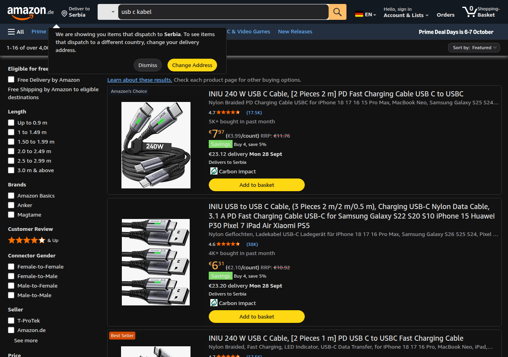
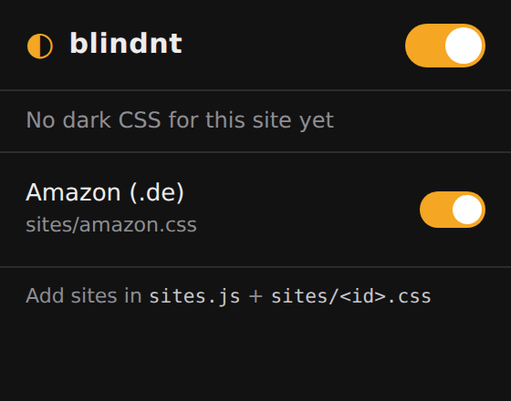

<p align="center">
  
</p>

<h1 align="center">blindnt</h1>

<p align="center">
  Hand-made dark mode for sites that refuse to ship one.<br>
  One popup. One switch per site. No filters, no inverted images, no "smart" heuristics — just CSS written by hand.
</p>

<p align="center">
  <a href="https://github.com/pbeocanin/blindnt/actions/workflows/ci.yml"></a>
  <a href="https://github.com/pbeocanin/blindnt/releases/latest"></a>
  
  
</p>

---

## Why

Generic dark-mode extensions invert everything and make product photos look like X-rays. Sites like Amazon still don't ship a dark theme in 2026. So: per-site stylesheets, written against the real DOM, that stay out of the way everywhere else.

<p align="center">
  
</p>

## Install

**From a release (recommended)**

1. Grab the latest `blindnt-x.y.z.zip` from [Releases](https://github.com/pbeocanin/blindnt/releases/latest) and unzip it.
2. Open `chrome://extensions`, turn on **Developer mode** (top right).
3. **Load unpacked** → pick the unzipped folder.

**From source**

```sh
git clone https://github.com/pbeocanin/blindnt
```

Then load the cloned folder the same way. Works in Chrome, Edge, Brave, Arc — anything Chromium.

## Use



Click the ◐ icon.

- **Top switch** — master on/off for everything.
- **One switch per site** — disable a single site's dark CSS without touching the rest.
- The status line tells you whether the page you're on is supported.

Toggles apply instantly to open tabs — no reload.

<br clear="right">

## Supported sites

| Site | File | Notes |
|------|------|-------|
| Amazon | [`sites/amazon.css`](sites/amazon.css) | All TLDs (`amazon.de`, `amazon.com`, …). Written against amazon.de. Home, search + filters, product pages, cart, nav flyouts, cookie banner. |

## Adding a site

Two steps, no build:

1. **Write the CSS** at `sites/<id>.css`. Use `!important` freely — you're fighting the site's own stylesheet.
2. **Register it** in [`sites.js`](sites.js):

   ```js
   {
     id: 'example',
     name: 'Example',
     match: (h) => h === 'example.com' || h.endsWith('.example.com'),
     css: 'sites/example.css',
   }
   ```

That's it. The popup lists it, the content script injects it. Reload the extension on `chrome://extensions` to pick up changes.

A good starting palette (the one Amazon uses):

| Role | Color |
|------|-------|
| page background | `#121212` |
| panels / cards | `#1c1c1e` |
| raised / inputs | `#242426` |
| borders | `#333` |
| text | `#e6e6e6` |
| muted text | `#a1a1a6` |
| links | `#6cb6ff` |

Tip: a catch-all for inline white backgrounds saves a lot of pain —
`[style*="background-color: rgb(255, 255, 255)"] { background-color: #1c1c1e !important; }`

## How it works

```
sites.js      registry: [{ id, name, match(hostname), css }]  — shared by popup + content script
content.js    runs at document_start on every page:
                match hostname → read storage → inject <style> (tiny bg rule first, then the file)
                listens to storage changes → add/remove live
popup.js      renders the switches, writes { enabled, sites: { id: bool } } to chrome.storage.local
```

Permissions: `storage` (your toggles) and `activeTab` (to name the site in the popup). Nothing leaves your browser.

## Releasing

Bump `version` in `manifest.json`, then:

```sh
git tag v0.2.0 && git push --tags
```

The [release workflow](.github/workflows/release.yml) checks the tag matches the manifest, zips the extension and publishes a GitHub release with the zip attached.

## License

MIT
